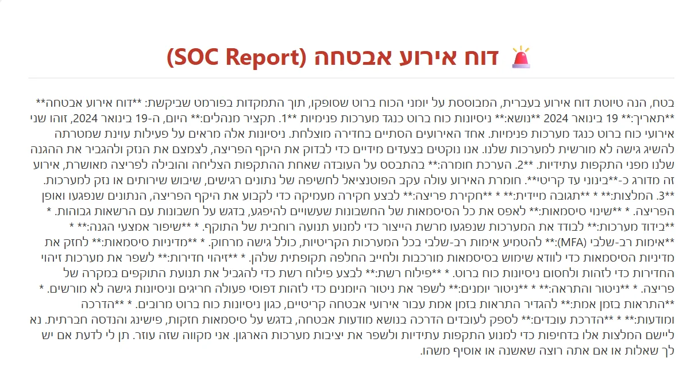
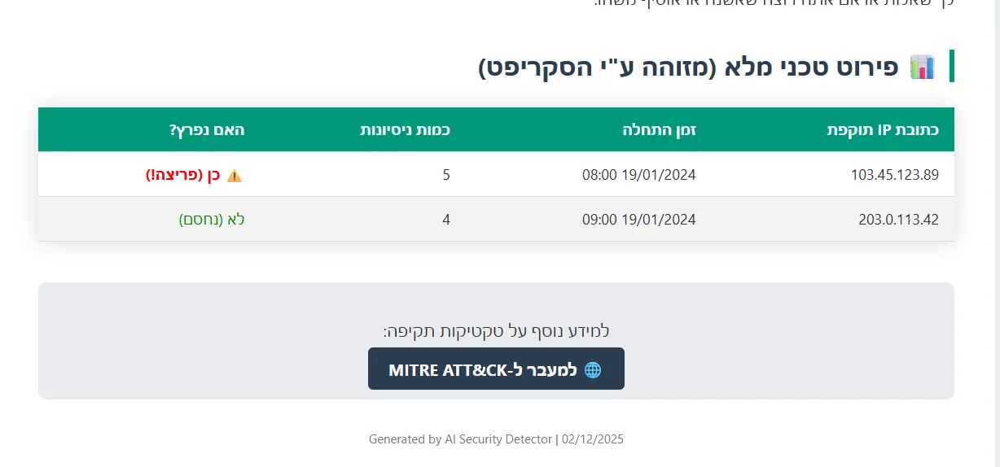

# 🛡️ Brute Force Attack Detector

<div align="center">


**כלי אבטחה אוטומטי מבוסס AI לזיהוי והערכת התקפות כוח גס**

[🌐 אתר הפרויקט](index.html) • [🔧 הסבר מפורט](code_explanation.html) • [📖 דוקומנטציה](#)

</div>

---

## 📋 תוכן עניינים

- [תיאור הפרויקט](#-תיאור-הפרויקט)
- [תכונות](#-תכונות)
- [דוגמאות](#-דוגמאות)
- [התקנה](#-התקנה)
- [שימוש](#-שימוש)
- [איך זה עובד](#-איך-זה-עובד)
- [דיסקליימר](#️-דיסקליימר)
- [רישיון](#-רישיון)

---

## 🎯 תיאור הפרויקט

פרויקט סייבר מתקדם שנועד לזהות התקפות **Brute Force** בלוגי שרת ולהפיק דוחות אבטחה מקצועיים באופן אוטומטי.

הכלי משלב:
- 🐍 **Python** - עיבוד וניתוח לוגים
- 🤖 **Google Gemini AI** - יצירת דוחות SOC מקצועיים
- 📊 **HTML Reports** - דוחות מעוצבים עם המלצות מעשיות
- 🎯 **Detection Algorithm** - זיהוי דפוס "Succeed-After-Fail"

---

## ✨ תכונות

### 🔍 זיהוי מתקדם
- אלגוריתם **Sliding Window** לזיהוי התקפות
- זיהוי דפוס "Succeed-After-Fail" (פריצה לאחר ניסיונות)
- תמיכה בהגדרות מותאמות אישית

### 🤖 אינטגרציה עם AI
- ניתוח אוטומטי של ממצאים
- המלצות מקצועיות בעברית
- קישור אוטומטי ל-MITRE ATT&CK Framework

### 📊 דוחות מקצועיים
- דוח HTML מעוצב
- טבלה מפורטת של כל התוקפים
- הערכת חומרה (קריטי/גבוה/בינוני/נמוך)

---

## 📸 דוגמאות

### דוח שנוצר אוטומטית:

<p align="center">
  
  <br>
  <em>ניתוח AI בעברית עם המלצות מעשיות</em>
</p>

<p align="center">
  
  <br>
  <em>טבלה טכנית מפורטת עם כל התוקפים</em>
</p>

---

## 🚀 התקנה

### דרישות מוקדמות

- Python 3.8 ומעלה
- pip (מנהל חבילות Python)

### התקנת ספריות

```bash
pip install pandas --break-system-packages
pip install google-generativeai --break-system-packages
```

---

## 💻 שימוש

### 1. קבלת מפתח API

קבל מפתח API חינמי מ-Google:
```
https://aistudio.google.com/app/apikey
```

### 2. הגדרת המפתח

פתח את `detector.py` ושנה:
```python
GEMINI_API_KEY = "YOUR_KEY_HERE"
```

### 3. הרצת הכלי

```bash
python3 detector.py
```

### 4. צפייה בדוח

```bash
xdg-open report.html  # Linux
open report.html      # Mac
start report.html     # Windows
```

---

## 🔬 איך זה עובד?

### שלב 1: עיבוד לוגים
הסקריפט קורא את קובץ `server_log.csv` ומסנן ניסיונות התחברות כושלים (HTTP 401).

### שלב 2: זיהוי התקפות
אלגוריתם **Sliding Window** בודק:
- האם היו 3+ ניסיונות כושלים מאותה IP?
- האם הם היו בתוך חלון זמן של 5 דקות?
- האם הייתה התחברות מוצלחת לאחר מכן?

### שלב 3: ניתוח AI
הנתונים נשלחים ל-**Google Gemini** שמחזיר:
- תקציר מנהלים בעברית
- הערכת חומרה
- המלצות מעשיות

### שלב 4: דוח HTML
נוצר קובץ `report.html` עם:
- ניתוח AI מלא
- טבלה של כל התוקפים
- קישור ל-MITRE ATT&CK

---

## 📁 מבנה הפרויקט

```
brute-force-detector/
├── detector.py                 # הסקריפט המרכזי
├── server_log.csv             # לוגים לדוגמה
├── index.html                 # אתר הפרויקט
├── code_explanation.html      # הסבר מפורט
├── README.md                  # קובץ זה
├── .gitignore                 # קבצים להתעלמות
└── צילומי מסך/               # דוגמאות ויזואליות
```

---

## ⚙️ הגדרות מתקדמות

ניתן לשנות את הרגישות בקובץ `detector.py`:

```python
FAILED_ATTEMPTS_THRESHOLD = 3   # כמה כישלונות = חשוד?
TIME_WINDOW_MINUTES = 5         # בתוך איזה חלון זמן?
```

---

## ⚠️ דיסקליימר

**פרויקט זה נוצר למטרות חינוכיות בלבד.**

- ✅ מותר: שימוש על מערכות שבבעלותך
- ✅ מותר: מעבדות לימוד וסביבות מבודדות
- ✅ מותר: בדיקות חדירה מורשות
- ❌ אסור: שימוש על מערכות ללא אישור
- ❌ אסור: פעילות פלילית

שימוש לא מורשה במערכות מחשוב הוא עבירה פלילית לפי החוק.

---

## 🤝 תרומה לפרויקט

רוצה לשפר את הפרויקט? בברכה!

1. Fork את הrepository
2. צור branch חדש (`git checkout -b feature/amazing-feature`)
3. Commit את השינויים (`git commit -m 'Add amazing feature'`)
4. Push ל-branch (`git push origin feature/amazing-feature`)
5. פתח Pull Request

---

## 📄 רישיון

פרויקט זה מוגן תחת רישיון MIT - ראה קובץ [LICENSE](LICENSE) לפרטים.

---

## 👨‍💻 יוצר

**שון** - בוגר קורס סייבר

- 🎓 SOC Analyst in Training
- 🐍 Python Security Developer
- 🛡️ Cybersecurity Enthusiast

---

## 🙏 תודות

- [Google Gemini](https://ai.google.dev/) - AI API
- [MITRE ATT&CK](https://attack.mitre.org/) - מסד ידע על טכניקות תקיפה
- [Pandas](https://pandas.pydata.org/) - ספריית ניתוח נתונים

---

<div align="center">

נוצר באהבה ❤️ למטרות חינוכיות

**⭐ אם הפרויקט עזר לך - תן לו כוכב! ⭐**

</div>
